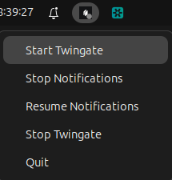

# Twingate Linux Desktop

Currently, this is an AppIndicator (icon in the tray) with options to start, stop Twingate, and pause/resume its notifications.



In future releases, we will add the ability to initialize and configure the Twingate application through the UI.

### Prerequisites
The Twingate application must be installed. You can install it using the following command:

`curl -s https://binaries.twingate.com/client/linux/install.sh | sudo bash`

### Installation
For a full installation, run clone repository and run script:

```
git clone https://github.com/Yur-k/twingate-linux-desktop
./install.sh -y
```

If you do not want to add autostart and an icon in the main menu, install in interactive mode:

`./install.sh`

### Uninstall

To uninstall, run the script:

`./uninstall.sh`

### Manual execution
In repository root run application binary:
`twingate-desktop`
If you installed by script, run: 
`/opt/twingate-desktop/twingate-desktop`

